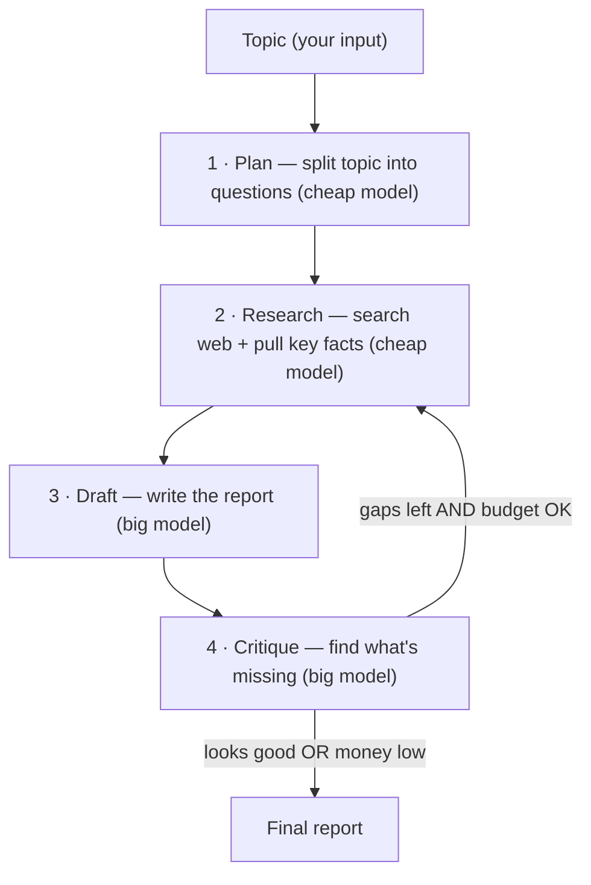
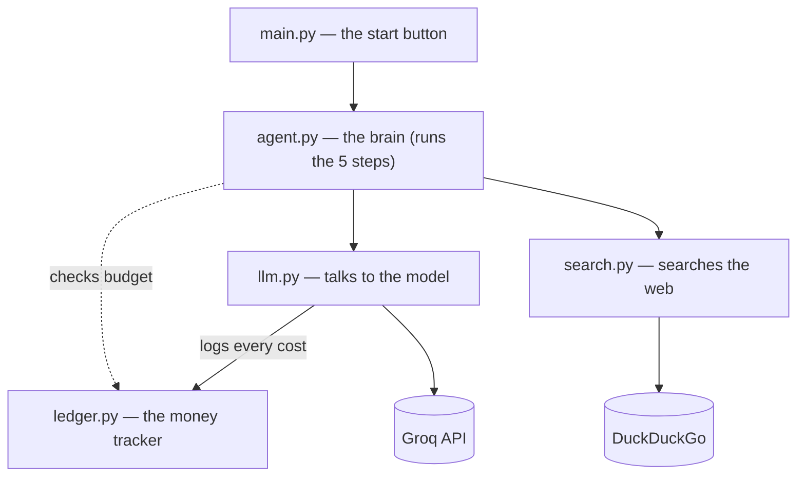

# TokenScout

A small AI research agent that does the digging for you — and keeps an eye on the bill while it does it.

You give it a topic. It breaks that topic into questions, searches the web, writes you a short report, then reads its own report to catch what it missed and fixes it. The whole time, it's counting exactly what each step costs, and it won't go over the budget you set.

## Why I built it

AI agents are easy to build and easy to leave running. The problem is they quietly burn money. Every time an agent calls a big model, it costs something. Do that in a loop, a few hundred times a day, and the bill gets huge — and nobody saw it coming.

So I wanted to build the opposite: an agent that treats money like it matters.

Three rules:
- Use a cheap model for the easy work. Only pay for the big model when the task actually needs brains.
- Track every cost the moment it happens — don't guess later.
- Treat the budget as a hard stop, not a maybe.

## How it works

You hand it a topic, and it runs five steps:



1. **Plan** — break the topic into a few clear questions. *(cheap model)*
2. **Research** — search the web for each one, pull out the key facts. *(cheap model)*
3. **Draft** — put all the facts together into one report. *(big model)*
4. **Critique** — read its own report and find what's missing. *(big model)*
5. **Refine** — if something's missing and there's still budget, go research the gaps and rewrite. Otherwise, stop.

It stops when the report looks done, the money runs low, or it's finished the number of review rounds you asked for.

## The files

Each file does one job:



- **search.py** — the eyes. Searches the web and hands back clean results.
- **llm.py** — talks to the model, and logs the cost of every call on its own.
- **ledger.py** — the money tracker. Knows what's been spent and what's left.
- **agent.py** — the brain. Runs the five steps and checks the budget before spending more.
- **main.py** — the start button. You run this with your topic.
- **hello_groq.py** — the first little test I wrote to check the API works. Kept it around.

## The two models

I use two models — a cheap fast one for the simple steps, and a slower expensive one for the hard steps (writing and reviewing).

| Model | Job | Rough cost |
|-------|-----|------------|
| `llama-3.1-8b-instant` | planning, searching, pulling facts | very cheap |
| `llama-3.3-70b-versatile` | writing the report, reviewing it | ~12x more |

The big model costs roughly 12x more, so the whole trick is to use it as little as possible. Most of the work goes to the cheap one.

(Groq is free right now, so none of this actually costs me anything yet. But I track the cost as if it did — that way the habit's already in place when I move to a paid model later.)

## Setup

Install what it needs:

```bash
pip install groq python-dotenv ddgs
```

Make a `.env` file in the folder:

```
GROQ_API_KEY=your_key_here
```

You can get a free key at console.groq.com.

## How to run

Just give it a topic:

```bash
python main.py "prompt caching in LLMs"
```

Or set a budget and how many review rounds you want:

```bash
python main.py "AI FinOps" --budget 0.05 --rounds 2
```

You can also test each piece on its own:

```bash
python search.py     # try the web search
python ledger.py     # see the cost tracker demo
python llm.py        # one model call, cost logged automatically
```

## What a run looks like

```
--- COST LEDGER ---
plan      | llama-3.1-8b-instant     |   450 tokens | $0.000027
extract   | llama-3.1-8b-instant     |  2100 tokens | $0.000150
draft     | llama-3.3-70b-versatile  |  2300 tokens | $0.001517
critique  | llama-3.3-70b-versatile  |  1200 tokens | $0.000900
TOTAL: $0.002594 spent / $0.0100 budget
```

That cost table at the end is the whole point — you can see exactly where every cent went, and that the cheap model did most of the work.

## What's next

The core works. Stuff I still want to add:
- A router that picks the model on its own, based on how hard the task is.
- Cost estimation before each call, so the budget brake looks ahead instead of just reacting.
- When the budget gets low, drop to the cheap model and keep going instead of stopping.
- Save the cost report to a file after each run.
